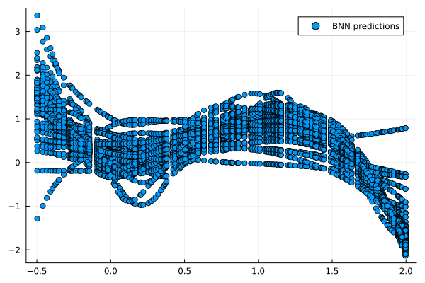

# Stein variational gradient descent for Bayesian Neural Networks
Contains the code used for my project work **Applicability of SVGD for high-dimensional problems using Neural Networks** and the results discussed in the corresponding paper. The work was supervised by the Department of Stochastic Simulation and Safety Research for Hydrosystems (LS3) at the university of Stuttgart.

## Content
To properly understand everything, basic knowledge of neural networks and sampling methods is required.

The main goal of the presented work is to assess wether it is feasible to use SVGD for uncertainty quantification in neural networks. The combination of SVGD and NNs poses an interesting task, as Bayesian inference on neural networks is a non-trivial problem especially with large networks. Furthermore, with SVGD being a gradient-based method the straightforward gradient access in a neural network is helpful.

## Setup
The key parameters/parts of the main.jl script are:

***layers*** 1d-array with layer structure of the neural network

***f*** data generating function

***loss_function*** empiric loss function of the neural network

***σ*** variance of bayesian prior

***nop*** number of particles used for the SVGD algorithm

***bandwidth*** kernel bandwidth

***iterations*** number of iterations for which svgd is performed


To see if the script is working try:

layers=[1 4 4 1]

σ=1

nop=64

bandwidth=5

iterations=20000

rng seed=42

This should yield the following results:



## Sources

```
@misc{liu2019stein,
      title={Stein Variational Gradient Descent: A General Purpose Bayesian Inference Algorithm}, 
      author={Qiang Liu and Dilin Wang},
      year={2019},
      eprint={1608.04471},
      archivePrefix={arXiv},
      primaryClass={stat.ML}
}

@article{Jospin_2022,
   title={Hands-On Bayesian Neural Networks—A Tutorial for Deep Learning Users},
   volume={17},
   ISSN={1556-6048},
   url={http://dx.doi.org/10.1109/MCI.2022.3155327},
   DOI={10.1109/mci.2022.3155327},
   number={2},
   journal={IEEE Computational Intelligence Magazine},
   publisher={Institute of Electrical and Electronics Engineers (IEEE)},
   author={Jospin, Laurent Valentin and Laga, Hamid and Boussaid, Farid and Buntine, Wray and Bennamoun, Mohammed},
   year={2022},
   month=may,
   pages={29–48}
}
```
